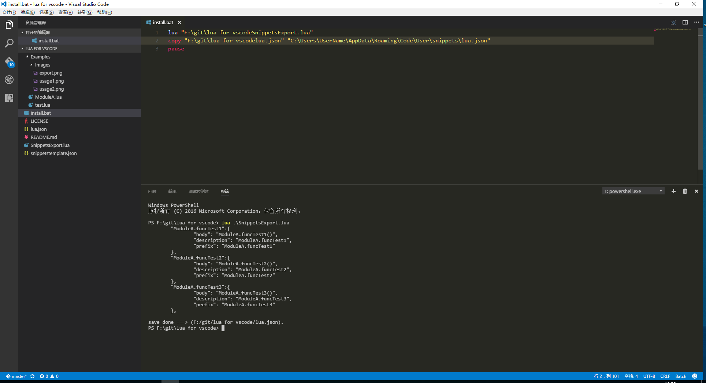
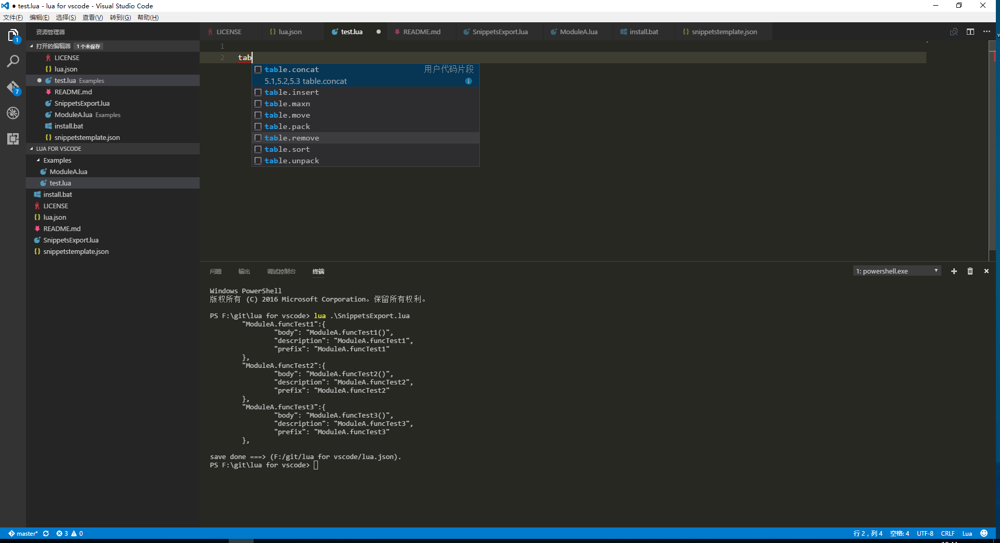
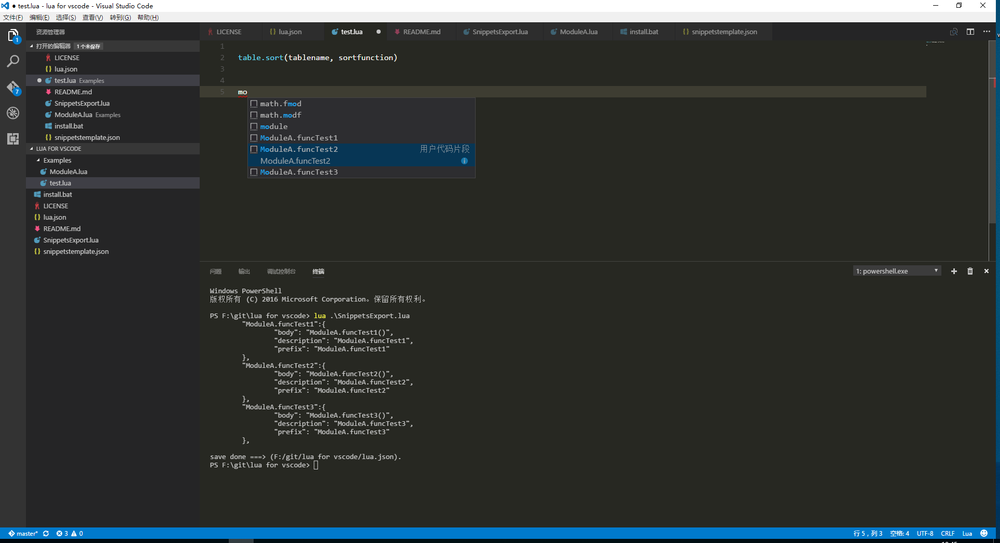

# lua-for-vscode
A simple lua tool for visual studio code

## Features
* Autocompletion

## Usage

```
> lua SnippetsExport.lua
```





## Requirements
* [lua](http://www.lua.org/download.html)
* [lfs(lua file system)](https://github.com/keplerproject/luafilesystem)

## License

[MIT](./LICENSE)
